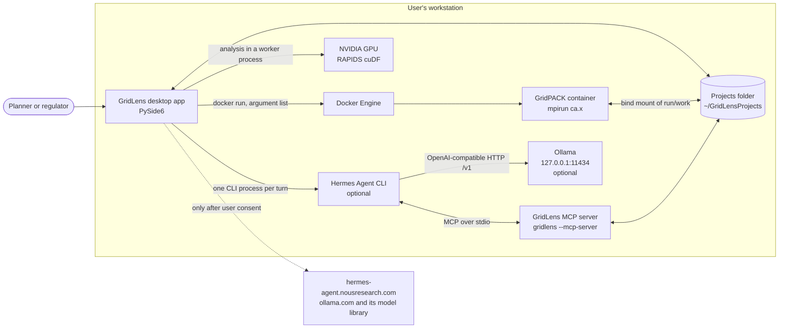
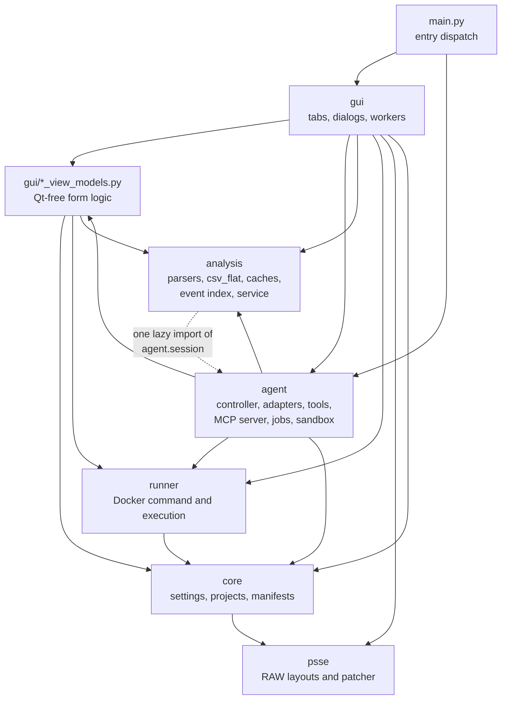
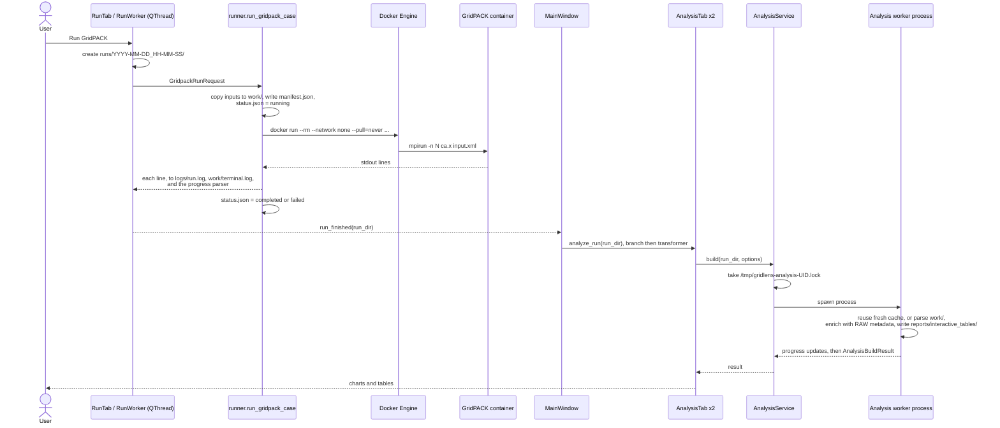
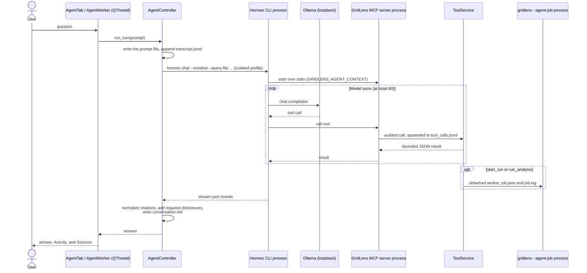
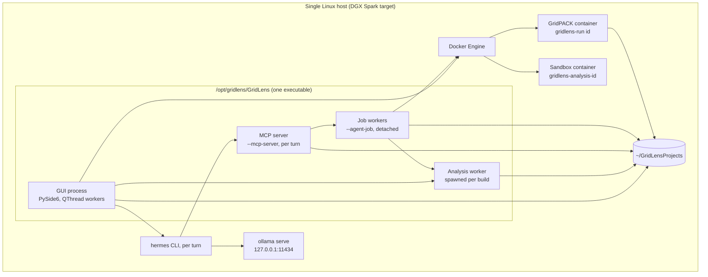

# GridLens Architecture Overview

GridLens is a local desktop application for GridPACK contingency analysis. A user sets up a project from
PSS/E RAW and GridPACK XML files, runs GridPACK's contingency analysis (`ca.x`) in a Docker container, and
reviews branch and transformer loading as tables and charts. An optional planning agent, Clarke, answers
questions about the same projects and runs, can set up and start studies, including runs of edited copies of
a case, and can search the user's reference documents, using a model that runs on the same machine.

This document describes the `main` branch. It was last verified against commit `eee3511` on 2026-09-29, and
updated on 2026-09-30 for four agent additions: sensitivity runs the agent can start, the topology tool, the
reference document search, and time and token accounting.
Update it in the same change as any change to a boundary, a process, a data store, or a dependency it
describes, and re-verify it before each release. Where a fact cannot be established from the repository,
this document says **Not evident from the repository**.

Contents:

1. Project Structure
2. High-Level System Diagram
3. Core Components
4. Data Stores
5. External Integrations / APIs
6. Deployment & Infrastructure
7. Security Considerations
8. Development & Testing Environment
9. Future Considerations / Roadmap
10. Project Identification
11. Glossary / Acronyms

## 1. Project Structure

GridLens is one Python package, `gridlens`, under `src/`, with a PySide6 GUI on top of plain-Python layers.
There is no separate server or web front end.

```text
gridpack-workbench-dev/
├── src/gridlens/                 # The application package
│   ├── main.py                   # Entry point: GUI, --mcp-server, --agent-tool, --agent-job
│   ├── __main__.py               # Makes `python -m gridlens` call main()
│   ├── gui/                      # PySide6 window, eight tabs, dialogs, QThread workers
│   │   └── *_view_models.py      # Qt-free form logic, shared with the agent tools
│   ├── core/                     # Settings, projects, validation, run manifests, sensitivity runs
│   ├── psse/                     # PSS/E RAW record layouts, reader, byte-preserving patcher,
│   │                             #   change requests by bus and ID
│   ├── runner/                   # Docker probes, docker-run command builder, GridPACK execution
│   ├── analysis/                 # Output parsers, csv_flat aggregation, caches, event index, exports,
│   │                             #   network topology of a RAW case
│   ├── agent/                    # Clarke: adapters, route policy, sessions, controller, tools,
│   │                             #   MCP server, background jobs, script sandbox, setup,
│   │                             #   reference documents, time and token accounting
│   └── resources/gridlens.svg    # Application icon
├── tests/                        # pytest suite (46 test modules and conftest.py)
│   └── data/                     # Synthetic three-bus RAW cases, versions 33, 34, and 35
├── scripts/                      # Environment check, launcher, version reader, agent evaluation tools
├── packaging/
│   ├── pyinstaller/              # gridlens.spec, and a runtime hook for numba-cuda
│   ├── deb/                      # build_deb.sh, control, postinst, postrm, desktop entry
│   └── agent/                    # Dockerfile and README for the generated-script sandbox image
├── docs/                         # User, developer, install, security, analysis, planning documents
│   ├── architecture.md           # This document
│   └── plans/                    # Design plans, evaluations, defect registers (not reference material)
├── samples/demo_outputs/         # A sample GridPACK success.txt
├── pyproject.toml                # Metadata, dependencies, extras, console script, pytest settings
├── requirements.txt              # Mirrors the runtime dependencies (checked by a test)
├── requirements-analysis.txt     # The analysis dependency set, including RAPIDS
├── CONTRIBUTING.md               # Local-only and CEII rules, verification steps
├── LICENSE                       # GPL-3.0
└── README.md
```

### 1.1 Where to make common changes

| Change | Where |
|---|---|
| A GridPACK XML setting shown in the Configuration tab | `gui/configuration_view_models.py` (`InputConfigurationValues`, `render_input_configuration_xml`, `merge_input_configuration_xml`), then the tab in `gui/configuration_tab.py`. The agent exposes the same settings through `CONFIGURATION_CHOICES` in `agent/gridlens_tools.py`. |
| The `docker run` command | `runner/docker_command.py` (`build_gridpack_docker_command`). The Run tab and agent jobs both reach it through `gui/run_view_models.py` (`build_gridpack_run_request`). |
| What a run records | `core/run_manifest.py` (`RunManifest`) and `runner/gridpack_runner.py` (`status.json`, logs). |
| A new GridPACK output format | `analysis/table_schemas.py` for whitespace text tables, `analysis/csv_flat.py` for CSV flat output, dispatched from `parse_all_output_tables` in `analysis/parsers.py`. Bump `PARSER_VERSION` in `analysis/parser_models.py` so old caches are rebuilt. |
| Loading and utilization calculations | `analysis/loading.py` and `analysis/utilization.py`. The charts and the agent tools both call them, so a change moves both. |
| A chart in Branch or Transformer Analysis | `gui/analysis_tab.py` (`_render_control_area_chart`, `_render_voltage_group_chart`, `_render_line_chart`). |
| A PSS/E record field used by sensitivity runs | `psse/layouts.py`; editing rules are in `psse/patch.py`; how the agent names records and scales loads is in `psse/changes.py`. |
| A network question the topology tool answers | `analysis/topology.py` (the graph, paths, islands, and splitting outages) and `agent/network_tools.py` (the tool). |
| A document format the reference search reads, or how passages are cut and scored | `agent/documents.py`; bump `INDEX_VERSION` so cached text is read again. |
| A new agent tool | A method decorated with `@tool` on `AnalysisTools` (`agent/tools.py`), `NetworkTools` (`agent/network_tools.py`), `FileTools` (`agent/file_tools.py`), `DocumentTools` (`agent/document_tools.py`), or `GridLensTools` (`agent/gridlens_tools.py`), added to the matching `*_TOOL_NAMES` tuple and, if it writes, to the write or destructive sets. The model's instructions are `SYSTEM_PROMPT` in `agent/prompt.py`. |
| A new agent runtime | A module implementing the `RuntimeAdapter` protocol (`agent/runtime.py`) and one `ProviderDescriptor` row in `agent/providers.py`. Nothing else should change. |
| The project folder layout | `core/project.py`. |
| Styling | `gui/theme.py` (Fusion style and one application style sheet). |
| Packaging | `packaging/pyinstaller/gridlens.spec` and `packaging/deb/`. |

## 2. High-Level System Diagram

A one-page rendering of the whole system, with its boundary, components, flows, security controls, error
paths, and hardware, is [`diagrams/gridlens_architecture.svg`](diagrams/gridlens_architecture.svg) (also as
PNG). `scripts/draw_architecture_diagram.py` redraws it; redraw it in the same change as any change to a
component or flow it shows. The Mermaid diagrams below show each view separately.

### 2.1 System context

Everything runs on one machine. GridLens starts network traffic in three cases only: a Docker image pull,
which happens only when a run's pull policy is `missing` or `always` rather than the default `never`; a
hosted agent runtime, which is disabled by policy; and the optional download of Hermes Agent, Ollama, and
models, after the user agrees in the Set up Clarke window. The reference document search calls Ollama only on
loopback, for embeddings, and only when the user has installed an embedding model.



### 2.2 Component relationships

The arrows show which package imports which, as found in the source on `main`.



`analysis` depends on no other GridLens package except that one lazy import, which makes a cycle with
`agent` (Section 9.2). `psse` depends on nothing in GridLens.

### 2.3 Data flow: a run from the Run tab, and its analysis



A sensitivity run takes the same path. The Sensitivity Analysis tab patches a copy of the project's RAW case
in memory (`psse/patch.py`), and `core/sensitivity.py` writes the edited case, a copy of the XML naming it,
and `sensitivity_changes.json` into the run's `work/` folder before the Run tab starts GridPACK.

### 2.4 Data flow: one Clarke turn



### 2.5 Architectural boundaries

| Boundary | What crosses it | Enforced by |
|---|---|---|
| GUI process and GridPACK container | The run's `work/` folder, bind-mounted at `/app/workspace`; the command's stdout | `runner/docker_command.py`: argument list, `--network none`, `--pull=never` by default, `-u uid:gid` |
| GUI process and analysis worker | Run folder path and options in; progress and an `AnalysisBuildResult` back through a `multiprocessing` queue | `analysis/service.py`: `spawn` context, cross-process file lock, group kill on cancel |
| GridLens and the model runtime | Prompt files, stream-json events, MCP tool calls and results | `agent/policy.py` (loopback-only route), `agent/hermes.py` (isolated profile, pinned version), `agent/controller.py` (deadline and byte caps) |
| Model and the file system | Only what `ToolService` returns | `agent/session.py` `scoped_path`, tool result bounds in `agent/tool_base.py`, confirmation of destructive changes |
| Model-written code and the machine | A reviewed script and one run folder, read-only | `agent/scripts.py`: execution only from the review dialog, hash binding, a network-free, read-only, non-root container |

### 2.6 Architectural decisions and their consequences

These decisions are visible in the code and in the repository's documents. No formal decision records exist.

1. **GridPACK runs out of process, in Docker, never in a shell.** The command is built as a Python list and
   run with `subprocess.Popen` without `shell=True`. The container gets `--network none`, the run's pull
   policy (`never` by default), the host UID and GID, and only the run's `work/` folder, unless extra Docker
   arguments add more.
   *Why:* the inputs are Critical Energy/Electric Infrastructure Information (CEII), and GridPACK with its
   MPI toolchain comes as prebuilt Docker images. *Consequences:* the user must be able to run Docker, which on
   Linux means `docker` group membership, which is root-equivalent; images must be pulled or loaded before
   use; and GridLens cannot run GridPACK without Docker.
2. **All state lives in plain files in the projects folder.** Projects, runs, caches, agent sessions, and
   jobs are JSON, JSONL, CSV, Parquet, and text files. *Why:* local-only operation, auditability, and files a
   reviewer can open. *Consequences:* there is no database, no transactions, and no schema migration beyond
   version constants that invalidate caches; concurrency is handled by a few file locks and atomic
   replaces; `project.json` stores absolute paths (Section 9.1).
3. **Inputs are copied, twice.** Adding inputs copies them into `original_inputs/`, and every run copies them
   into its own `work/` with SHA-256 hashes in `manifest.json`. *Why:* a run's inputs cannot change after
   it ran, and the manifest proves what it used. *Consequence:* disk use grows with each run.
4. **Analysis runs in a spawned process, one build at a time.** `AnalysisService` serializes builds from the
   GUI and from agent jobs with a file lock and runs each in a `spawn` subprocess. *Why:* RAPIDS and Dask hold
   GPU and host memory, and a cancelled build must release it and stop its children. *Consequence:* a second
   build waits, reporting "Waiting for another analysis build".
5. **GPU first, with explicit CPU fallbacks.** CSV flat aggregation tries cuDF, then dask-cuDF, then CPU
   Dask, and finally a Python stream. CPU Dask runs only when `GRIDLENS_ALLOW_CPU_DASK` is set. The analysis
   tabs set it whenever a build would fall back to it, after showing the warning in a dialog (a build the
   user started) or in the status line's tooltip (the automatic build after a run); the dialog has only an
   OK button. Agent jobs always set it and record the warning in `job.log`. *Why:* multi-gigabyte flat
   result files on a DGX Spark. *Consequence:* the selection logic is the most intricate code in the
   repository (`analysis/csv_flat.py`, about 1,600 lines).
6. **Caches are versioned, not migrated.** `reports/` caches carry `dataset_version` and `parser_version`,
   and the event index carries `INDEX_VERSION`. In the chart path, a mismatch or a newer source file makes
   GridLens rebuild the cache. The agent tools instead refuse a stale cache (`ANALYSIS_NOT_BUILT`) or a stale
   event index (`INDEX_STALE`) and tell the model to rebuild with `run_analysis`; the event index is built
   only when that tool asks for it. *Consequence:* changing a parser means bumping its constant.
7. **The agent computes nothing itself.** The numbers in an answer are meant to come from deterministic
   GridLens functions called as tools, and the controller rewrites any citation that does not match a
   recorded call. The one exception is the output of a generated script the user approved, which the
   tools can read; the controller then appends a note that those results are unverified. *Why:* model
   output is not trusted for numerical truth. *Consequence:* analytical capability grows only by adding or
   extending tools, or through reviewed scripts whose results carry that note.
8. **The agent is model-agnostic behind one adapter contract.** `RuntimeAdapter` (`agent/runtime.py`) and
   the registry in `agent/providers.py` isolate each vendor CLI; the tool layer, sessions, and controller
   contain no provider-specific code. The GUI does: `gui/agent_tab.py` takes `DEFAULT_ENDPOINT` from
   `agent/hermes.py`, and `gui/agent_setup.py` is the Hermes and Ollama setup window, built on
   `SUPPORTED_HERMES` and `agent/setup.py`. The GridLens tools are served over the Model Context Protocol
   (MCP) with the official SDK. Each adapter also pins the exact CLI version it was validated against and
   refuses others (Hermes 0.21.4, Claude Code 2.1.278, Codex CLI 0.155.1), because a changed event format
   would otherwise surface as a wrong answer rather than an error. *Consequence:* every CLI upgrade needs a
   revalidated adapter.
9. **Inference must stay on the machine.** A session's route is fixed when it is created. The Ollama
   endpoint must resolve only to loopback, redirects and proxies are refused, cloud or remote models are
   rejected, and the model is re-verified every turn. Hosted runtimes need an operator-set environment
   variable and stay disabled by policy. *Why:* CEII rules in `CONTRIBUTING.md` and the security notes.
10. **Agent actions reuse the GUI's functions.** Tools that create projects, write XML, and start runs call
    the same `core/`, `runner/`, and view-model functions as the tabs, so an agent-started run gets the same
    Docker command as a Run tab run given the same settings, and a sensitivity run the agent starts writes its
    edited case through the same `core/sensitivity.py` functions as the Sensitivity Analysis tab. Changes that
    replace inputs, rewrite an existing XML, or stop running work, and runs of an edited case, are held until
    the user replies in a later turn. *Consequence:* the view
    models, though under `gui/`, are imported by
    non-GUI code and must stay free of Qt.
11. **Long work outlives the turn.** Runs and analysis builds that the agent starts run as detached
    `gridlens --agent-job` processes with a file record, because the runtime stops the MCP server at the end
    of every turn. *Consequence:* jobs keep running after GridLens closes, and liveness is judged from a
    recorded process ID.
12. **Generated code is saved, never run by the model.** A tool can only save a proposed script; running it
    requires the user's approval of its exact SHA-256 in the GUI, and runs it in a separately prepared,
    label-checked, network-free container.
13. **Sensitivity edits are surgical text patches.** `psse/patch.py` rewrites only the characters of edited
    fields, removed lines, and added lines, reading and writing Latin-1 so every other byte is kept.
    *Why:* GridPACK's parsers are sensitive to the RAW text, and a reviewer can diff the edited case. The
    agent names records by bus and ID instead of by line; `psse/changes.py` turns its requests into the same
    `patch.Edit` list the tab builds, so both paths write identical cases.
14. **One self-contained bundle per architecture.** PyInstaller bundles Python, Qt, and RAPIDS into
    `/opt/gridlens`, wrapped in a `.deb`. *Why:* one `apt install` on DGX OS provides the application, its
    Python libraries including RAPIDS, and Docker as a package dependency.
    *Consequence:* a large package that must be built on the architecture it targets.

## 3. Core Components

### 3.1 Frontend

- **Name:** GridLens desktop GUI (`src/gridlens/gui/`).
- **Description:** One `MainWindow` (`gui/main_window.py`) holds a header and eight tabs. Tabs do not call
  each other: `MainWindow` connects their signals and calls their methods. Long work runs on `QThread`
  workers, so the window stays responsive.
- **Technologies:** PySide6 (Qt 6), matplotlib's QtAgg backend for charts, Qt's Fusion style with one style
  sheet (`gui/theme.py`).
- **Deployment:** The main process of the desktop application: `/opt/gridlens/GridLens` when installed
  from the `.deb`, or `gridlens` from a source checkout.

| Tab | Class and file | Responsibility |
|---|---|---|
| Project | `ProjectTab`, `gui/project_tab.py` | Create or open a project, add input files, pick the GridPACK configuration XML. Emits `project_changed`. |
| Configuration | `ConfigurationTab`, `gui/configuration_tab.py` | Generate the GridPACK XML, or edit an existing one in place, keeping elements it does not manage. |
| Run | `RunTab`, `gui/run_tab.py` | Check Docker, run GridPACK (`RunWorker`), stop a run (`TerminateWorker`), show the live log and progress. Emits `run_finished`. Saves the run settings. |
| Sensitivity Analysis | `SensitivityTab`, `gui/sensitivity_tab.py` | Edit loads, generators, and branches of the RAW case in a table model (`RecordTable`), then ask the Run tab to run the edited case. |
| Results | `ResultsTab`, `gui/results_tab.py` | List runs and their output files, open a run folder, export a run ZIP. Emits `run_selected`. |
| Branch Analysis, Transformer Analysis | `AnalysisTab` (two instances), `gui/analysis_tab.py` | Build or load a run's analysis through `AnalysisService` (`AnalysisWorker`), and chart maximum loading by control area, by voltage group, and by facility. The instances differ only in the facility filter. |
| Agent | `AgentTab`, `gui/agent_tab.py` | Clarke: session setup, conversation (`gui/agent_conversation.py`), Activity and Sources panes, saved conversations, Set up Clarke (`gui/agent_setup.py`), script review (`gui/script_review.py`), and the Open reference documents button. Each finished turn's process card shows its time and tokens. |

Signal wiring in `MainWindow`:

- `project_changed` from the Project and Configuration tabs → every tab's `set_project`.
- `run_finished` from the Run tab → refresh the run lists; if the run completed, `analyze_run` in both
  analysis tabs.
- `run_selected` from the Results tab → `select_run` in both analysis tabs and the Agent tab.
- `run_requested` from the Sensitivity tab → switch to the Run tab and start the edited case.
- `turn_finished` from the Agent tab → refresh run lists, since the agent may have started runs.
- Closing the window asks the Agent and analysis tabs to shut down their workers, then saves settings.

Background workers, all `QThread` subclasses: `RunWorker`, `TerminateWorker` (Run), `AnalysisWorker`
(analysis tabs), `RuntimeProbe` and `AgentWorker` (Agent), `SetupProbe` and `SetupWorker` (Set up Clarke), and
`ScriptWorker` (script review).

The `*_view_models.py` modules (`project`, `configuration`, `run`, `results`, `analysis`) hold the form logic:
defaults, validation, XML rendering and merging, and building run requests. They import no Qt, and the agent
tools import three of them, so a form rule and the matching agent tool share one implementation.

### 3.2 Backend Services

GridLens has no network services. Its "backend" is a set of in-process layers and a few child processes, all
on the user's machine.

#### 3.2.1 Core domain

- **Name:** `gridlens.core`.
- **Description:** The project and run model.
  - `app_settings.py`: `AppSettings`, loaded from and saved to the settings file (Section 4.1).
  - `project.py`: `Project`, `ProjectData`, and `InputFileRecord`; creates the project folders, copies inputs
    with SHA-256 hashes, creates run folders named `YYYY-MM-DD_HH-MM-SS`, tells a GridPACK configuration XML
    from other XML inputs, and refuses a project folder nested in another project or in a managed folder
    (`exports`, `logs`, `original_inputs`, `reports`, `runs`, `work`).
  - `run_manifest.py`: `RunManifest`, and the mapping of the host architecture to a Docker platform
    (`x86_64` to `linux/amd64`, `aarch64` to `linux/arm64`).
  - `sensitivity.py`: writes a sensitivity run's edited case, XML copy, and change list.
  - `validation.py`: project names, file paths, Docker image names, executables, and MPI process counts
    (1 to 4096).
- **Technologies:** Python standard library (`json`, `hashlib`, `xml.etree`).
- **Deployment:** In-process, in whichever process imports it.

#### 3.2.2 PSS/E RAW editing

- **Name:** `gridlens.psse`.
- **Description:** `layouts.py` defines the load, generator, and non-transformer branch fields of PSS/E
  versions 33, 34, and 35, with PSS/E's defaults, placed where GridPACK's block parsers read them.
  `parse.py` reads a case into `Case`, `Bus`, and `Record` objects, and reads transformers
  (`read_transformers`) and area names (`read_areas`) from the sections after the branch data. `patch.py`
  validates edits (`check`, `warnings`) and applies them (`apply`), changing only the edited text.
  `changes.py` resolves change requests that name a record by bus and ID, or select in-service loads or
  generators by area (number or name), zone, or bus to scale by a factor or a MW change, into `patch.Edit`s;
  it also totals in-service load and generation and says when the swing generator must supply a change.
- **Technologies:** Python standard library.
- **Deployment:** In-process, used by the Sensitivity tab, `core/sensitivity.py`, the agent's
  `start_sensitivity_run`, and `analysis/topology.py`.

#### 3.2.3 GridPACK runner

- **Name:** `gridlens.runner`.
- **Description:**
  - `docker_command.py`: `build_gridpack_docker_command` builds
    `docker run --rm --pull=<policy> --network none --platform <platform> -u <uid>:<gid> -e HOME=/tmp
    [--memory <limit>] --name gridlens-<run id> [extra args] -v <run>/work:/app/workspace -w /app/workspace
    <image> mpirun -n <N> ca.x <xml>`. Extra arguments are split with `shlex`, never passed to a shell.
  - `gridpack_runner.py`: `run_gridpack_case` copies inputs, writes the manifest and status, streams output
    to both log files and a callback, and records the exit code. `terminate_gridpack_run` runs
    `docker stop --time 10`, and `docker kill` if that fails or times out.
  - `docker_probe.py`: `docker --version`, `docker version`, and `docker image inspect` checks.
  - `run_progress.py`: `GridpackProgressParser` turns `ca.x` output into a progress fraction and message.
    It tolerates differing GridPACK builds and MPI ranks printing out of order.
- **Technologies:** `subprocess`, the Docker CLI.
- **Deployment:** In-process; called from the Run tab's `RunWorker` and from agent job workers.

#### 3.2.4 Analysis pipeline

- **Name:** `gridlens.analysis`.
- **Description:** Turns a run folder into normalized tables, utilization figures, and caches.
  - `parsers.py`: `parse_all_output_tables` reads `success.txt`, the whitespace text tables defined in
    `table_schemas.py` (`pflow`, `pflow_mm`, `qflow_mm`, `perf_mm`, `line_flt_cnt`, `vmag_mm`, and others),
    CSV flat output, the XML (`input_settings`), and RAW metadata.
  - `csv_flat.py`: detects the CSV flat result, convergence, and bus files, and aggregates the full result
    file by facility into the same `pflow_mm` shape the text path produces, with cuDF, dask-cuDF, CPU Dask,
    or a Python stream. It also builds the `contingency_summary` table (`contingencies.py`) in the same pass.
  - `raw_parsers.py`: bus, area, and branch metadata from the RAW case, including transformer-derived
    branch rows. `raw_sections.py` splits a RAW case into its sections for the agent's `read_file`.
  - `enrichment.py`: adds bus names, areas, and voltage classes to the parsed tables.
  - `loading.py` and `utilization.py`: per-facility maximum utilization and the control-area and
    voltage-group summaries shared by the charts and the agent.
  - `dataset.py`: `build_run_analysis`, the full pipeline. Called with its defaults, it also writes
    `reports/tables/`, `reports/analysis_manifest.json`, and Parquet copies of the flat result; on `main`
    only `master.py` calls it that way.
  - `interactive.py`: `build_interactive_analysis_result`, the lighter path behind the charts; it reuses a
    fresh cache or writes `reports/interactive_tables/`.
  - `event_index.py`: builds and queries a bucketed Parquet index of the flat result (`scan_cases`,
    `group_cases`) for per-contingency drill-down.
  - `topology.py`: the in-service AC network of a RAW case (branches, two-winding transformers, and
    three-winding transformers through a star point), with neighbourhoods, shortest paths, islands, and the
    single outages that split the network (bridges, by Tarjan's method). Pure Python; used by the agent's
    `topology` tool.
  - `master.py` and `distributions.py`: branch master CSVs and distribution plots. No GUI or agent code
    calls them on `main`; they are reachable only from Python.
  - `summary.py`: `export_run_zip`.
  - `gpu_pandas.py`: imports pandas through `cudf.pandas` when it imports, otherwise plain pandas.
- **Technologies:** pandas, pyarrow, Dask and `distributed`, RAPIDS (cuDF, dask-cuDF, dask-cuda, CuPy,
  numba-cuda) for CUDA 13, matplotlib.
- **Deployment:** In-process, but called through `AnalysisService` (3.2.5) by the GUI and agent jobs.

Utilization has two definitions, depending on the output format. For CSV flat output it is GridPACK's
`loading_percent`, and a facility's maximum is the largest absolute value across its rows. For the legacy
text output it is derived from MW flows and the RAW branch rating (Rate C). Facilities are keyed by
`from_bus`, `to_bus`, `line_id`, and `section`. Both analyses cover facilities at or above 50 kV
(`MIN_BRANCH_ANALYSIS_VOLTAGE_KV` in `analysis/loading.py`).

#### 3.2.5 Analysis build service

- **Name:** `AnalysisService` (`analysis/service.py`).
- **Description:** Serializes builds across the two analysis tabs and agent jobs with an exclusive lock on
  `/tmp/gridlens-analysis-<uid>.lock`, runs `build_interactive_analysis_result` (and, if asked,
  `build_event_index`) in a child process, relays progress, and on cancellation kills the child's whole
  process group.
- **Technologies:** `multiprocessing` with the `spawn` start method, `fcntl.flock`, POSIX process groups.
- **Deployment:** A short-lived child process per build.

#### 3.2.6 Clarke runtime layer

- **Name:** `gridlens.agent` (controller, adapters, route policy, sessions).
- **Description:**
  - `controller.py`: `AgentController` runs one turn: it writes the prompt file, starts the runtime,
    reads its stdout and stderr under a deadline (3,600 s by default) and a 16 MiB byte cap, turns each line
    into a `RuntimeEvent`, and audits it. It then post-processes the answer: `normalize_citations` marks
    invented call IDs, and helpers add disclosures for truncated results, failed tools, pending changes,
    generated-script output, and totals of flows measured in different directions, or replace an
    unsupported answer with a deterministic one (`verified_group_mean_answer`, `verified_top_line_areas`).
  - `runtime.py`: the contract: `RuntimeStatus`, `RuntimeEvent`, `PreparedRuntime`, `RuntimeAdapter`.
  - `providers.py`: the registry of `ProviderDescriptor`s: `hermes` (local, the default), `claude`
    (remote), `codex` (remote).
  - `hermes.py`: builds a throwaway Hermes profile in the session folder, exposing only the GridLens MCP
    server, and runs `hermes chat --oneshot --format stream-json` with at most 60 model turns. It refuses any
    Hermes version but 0.21.4.
  - `claude_code.py`: runs Claude Code in print mode with built-in tools removed and only the GridLens MCP
    server allowed. Usable only when the hosted gate is set and the user acknowledges the remote route.
  - `codex.py`: probes Codex CLI and refuses to start a turn, because its tool surface cannot be limited to
    GridLens tools.
  - `policy.py`: `DEFAULT_ENDPOINT`, `local_endpoint`, `ollama_json`, `verify_model`, and the hosted gate.
  - `prompt.py`: `SYSTEM_PROMPT` and the per-turn prompt, including a bounded replay of earlier turns when
    a runtime cannot resume.
  - `session.py`: `SessionContext`, written when a conversation starts and changed only when
    `migrate_legacy_sessions` moves a session from an older version and rewrites its `directory` and
    `projects_dir`; `find_project`, `resolve_run`, and `scoped_path`, which rejects traversal and symlinks.
  - `conversation_log.py`: writes `conversation.md` from the audit files after every turn, with each
    answer's time and tokens.
  - `accounting.py`: each turn's time, time in GridLens tools and per tool, time in the model and runtime,
    and token counts, computed from `transcript.jsonl`, `tool_calls.jsonl`, and `runtime_events.jsonl`. It
    keeps no state. The Agent tab, the conversation log, and the evaluation scripts use it.
  - `process.py`: the minimal child environment and process-group termination shared by adapters.
- **Technologies:** `subprocess`, `selectors`, `urllib` for the Ollama API.
- **Deployment:** In the GUI process, on the `AgentWorker` thread. The runtime CLI is a child process per
  turn.

#### 3.2.7 GridLens tool service and MCP server

- **Name:** `ToolService` (`agent/tools.py`) and the MCP server (`agent/mcp_server.py`).
- **Description:** `ToolService` combines five tool classes over `ToolBase` (`agent/tool_base.py`), which
  gives every call an ID (`T1`, `T2`, ...), checks its arguments, maps exceptions to stable error codes,
  pages rows by `offset` and `limit`, records sources, and writes paired `started` and `completed` records
  to `tool_calls.jsonl`. A result larger than 36,000 bytes is saved whole in the session's `results/`
  folder, and the inline copy keeps as many rows as fit plus the file paths.

  | Tool | Class | Kind |
  |---|---|---|
  | `rank`, `rank_groups` | `AnalysisTools` | Read. Sort or group facilities, contingencies, or indexed cases by one metric, with qualifiers and optional run comparison. The vocabulary is in `agent/objects.py`. |
  | `propose_analysis_script` | `AnalysisTools` | Write. Saves a script for review; never runs it. |
  | `topology` | `NetworkTools` | Read. From a run's own case or the project's: buses or elements within some hops of a bus, the shortest path between two buses, islands, and the single outages that split the network with what they cut off and, for a run, GridPACK's status for each. |
  | `search_documents` | `DocumentTools` | Read. Passages of the user's reference documents that match a query, with document, page, page label, and section; with no query, the list of documents. |
  | `list_files`, `read_file` | `FileTools` | Read. Any file in a GridLens project or the session folder, as table rows, RAW sections, JSON or XML fields, or text lines, with filters, joins, grouping, and document comparison. |
  | `list_projects`, `get_project`, `get_run_configuration`, `get_status` | `GridLensTools` | Read. `get_status` can wait up to 1,500 s for a job. |
  | `create_project`, `start_run`, `run_analysis` | `GridLensTools` | Write. `start_run` can override the saved image, pull policy, memory limit, and extra Docker arguments without confirmation. |
  | `start_sensitivity_run` | `GridLensTools` | Write, held for confirmation. Edits loads, generators, and non-transformer branches of a copy of the project's case (set, add, remove, or scale), and runs it with the Run tab's saved settings. The first call returns the changed fields and the load and generation totals before and after; the run starts only when the same call is repeated with `confirm=True` after the user's next message. |
  | `add_project_inputs`, `configure_run`, `stop` | `GridLensTools` | Destructive. A call that would replace an input with different content, switch the project's XML, rewrite an existing XML, or stop a running target returns a preview and changes nothing; the change is made only when the same call is repeated with `confirm=True` after the user has sent another message (`pending_changes.json`). New inputs, a project's first XML, and targets that are no longer running are handled at once. |

  Only the MCP server holds destructive changes for confirmation (`ToolService(context,
  confirm_changes=True)`); `--agent-tool` and other direct callers act at once, as a GUI button does.

  `mcp_server.py` serves these 18 tools with the MCP SDK's `FastMCP` over stdio, marking each tool's
  read-only and destructive hints, and returns results as compact JSON. `tool_cli` exposes the same tools
  without a model, as `gridlens --agent-tool <context.json> <tool> --arguments '<json>'`.
- **Technologies:** `mcp==1.30.0` (FastMCP), pyarrow for Parquet reads.
- **Deployment:** A child process of the runtime CLI, started per turn as `gridlens --mcp-server` (or
  `python -m gridlens --mcp-server` from source), with the session's `context.json` path in
  `GRIDLENS_AGENT_CONTEXT`. It imports no Qt.

#### 3.2.8 Agent background jobs

- **Name:** `gridlens.agent.jobs`.
- **Description:** `start_job` records a job in `<project>/agent/jobs/<job id>/job.json` and starts
  `gridlens --agent-job <folder>` in a new session. The worker (`run_job`) runs a GridPACK run with the
  settings `start_run` or `start_sensitivity_run` recorded (the Run tab's saved settings plus any overrides,
  and for a sensitivity run the XML copy that names its edited case, `request.xml_file`) or an analysis build
  through `AnalysisService`, records progress and the outcome in
  `job.json`, and appends a readable history to `job.log`. A completed run job goes on to build the branch
  and transformer analysis. `read_job` reports a job whose worker died without recording a result as
  failed. `cancel_job` sends SIGTERM to the worker's process group and stops the run's container.
- **Technologies:** `subprocess`, POSIX sessions and signals.
- **Deployment:** Detached processes that keep running after the turn and after GridLens closes.

#### 3.2.9 Generated-script sandbox

- **Name:** `gridlens.agent.scripts`, and the image recipe in `packaging/agent/`.
- **Description:** `save_proposal` writes a proposed script and its SHA-256 into the session's
  `generated/` folder, at most 30 per session. `execute_proposal`, reachable only from the review dialog,
  checks the approved hash, snapshots the bytes, verifies the image's `org.gridlens.purpose=generated-analysis`
  label, and runs the script with `docker create` and `docker start --attach`, capturing at most 256 KiB of
  output within 120 s. The container flags are listed in Section 7.
- **Technologies:** Docker CLI against `unix:///var/run/docker.sock`; an image the operator builds from a
  base pinned by digest (the documented example is `rapidsai/base`).
- **Deployment:** A short-lived container per approved execution.

#### 3.2.10 Clarke setup

- **Name:** `gridlens.agent.setup` and `AgentSetupDialog` (`gui/agent_setup.py`).
- **Description:** `check_setup` finds Hermes, Ollama, and installed models, and starts an installed Ollama
  that is not running. After the user agrees, it installs Hermes with its official installer at commit
  `5f5c9ef8f468667539d4d34e95f77eeb253cfc3c`, installs Ollama into GridLens's data folder, and pulls or
  deletes models through the local Ollama API. The catalog of validated models is `MODEL_CATALOG`, with
  `nemotron-3.5-lightning:latest` preferred.
- **Technologies:** `urllib`, `subprocess`, `tar` with `zstd`.
- **Deployment:** On a `SetupWorker` thread in the GUI process.

## 4. Data Stores

GridLens uses no database, cache server, or message queue. Every store is a file or folder on the local
disk, written with the Python standard library, pandas, or pyarrow.

### 4.1 Application settings

- **Type:** JSON file.
- **Location:** `$XDG_CONFIG_HOME/gridlens/settings.json`, or `~/.config/gridlens/settings.json`.
- **Purpose:** Defaults and the Run tab's last settings, loaded at startup and saved when the window
  closes and when a run starts.
- **Fields (`AppSettings`):** `app_name` (`GridLens`), `default_gridpack_image` (`pnnl/gridpack:latest`),
  `default_xml_file` (`input.xml`), `default_mpi_processes` (4), `default_projects_dir`
  (`~/GridLensProjects`), `docker_pull_policy` (`never`; also `missing` or `always`), `memory_limit` (empty),
  `extra_docker_args` (empty). Unknown keys are ignored.

### 4.2 Projects folder and projects

- **Type:** Folder tree.
- **Location:** The `default_projects_dir` setting, by default `~/GridLensProjects/`.
- **Purpose:** Everything a user creates: projects, their runs, Clarke's conversations, and the reference
  documents Clarke searches.

```text
~/GridLensProjects/
├── Clarke conversations/          # Agent sessions, one folder each (4.5)
├── Reference documents/           # Standards and criteria Clarke searches, and their cache (4.7)
└── <Project_Folder>/
    ├── project.json               # The project record
    ├── original_inputs/           # Copies of the input files, and generated XML
    ├── runs/<YYYY-MM-DD_HH-MM-SS>/  # One folder per run (4.3)
    ├── exports/                   # Run ZIPs: <run id>.zip
    └── agent/
        ├── jobs/<job id>/         # Agent background jobs (4.6)
        └── sessions/              # Sessions written by older versions, still listed
```

- **Key schema (`project.json`):** `name`, `root_dir`, `created_at`, `updated_at`, `xml_file_name`, and
  `input_files`, each with `file_name`, `source_path`, `stored_path`, `sha256`, `size_bytes`, and
  `imported_at`. `root_dir` and `stored_path` are absolute paths.

### 4.3 Run folder

- **Type:** Folder tree.
- **Purpose:** The immutable inputs, the solver's outputs, and the record of one GridPACK run.

| Path | Written by | Contents |
|---|---|---|
| `manifest.json` | `runner/gridpack_runner.py` | `run_id`, `created_at`, `project_name`, `gridpack_image`, `gridpack_executable`, `xml_file`, `mpi_processes`, `docker_platform`, `host_architecture`, `network_mode`, `pull_policy`, `container_name`, the exact `command`, `input_files` with SHA-256, `notes` |
| `status.json` | runner | `status` (`running`, `completed`, `failed`), `updated_at`, `return_code`, `error` |
| `work/` | runner, then GridPACK | Copied inputs and every GridPACK output, including `terminal.log`; for sensitivity runs also `<case>_sensitivity.raw`, `<xml>_sensitivity.xml`, `sensitivity_changes.json` |
| `logs/run.log` | runner | The command and the streamed output |
| `reports/` | analysis | Caches (4.4) |
| `exports/` | `analysis/master.py`, `distributions.py` | `master.csv`, `master_cleaned.csv`, `outliers.csv`, `distributions/`, when those exporters run |

### 4.4 Analysis artifacts

| Path under `reports/` | Written by | Purpose and invalidation |
|---|---|---|
| `interactive_analysis_manifest.json`, `interactive_tables/*.csv` | `analysis/interactive.py` | The chart cache: `pflow_mm`, `branch_metadata`, `area_metadata`, and optional `contingency_summary` and `bus_metadata`. Rejected when `dataset_version` or `parser_version` differs from the code (both `2026.07.05` on `main`), or when a source file is newer. |
| `analysis_manifest.json`, `tables/*.csv`, `tables/*.json` | `analysis/dataset.py` | The full analysis. Written only by a default `build_run_analysis` call, which on `main` only the uncalled `analysis/master.py` makes, so the application itself never writes it. The chart path and the agent tools still read it first when it is present and fresh. |
| `parquet/<flat file stem>/` | `analysis/csv_flat.py` | A Parquet copy of the CSV flat result, written by the same default call and likewise never by the application. |
| `event_index/manifest.json`, `event_index/<generation>/bucket-NN.parquet` | `analysis/event_index.py` | The drill-down index: rows bucketed by event into 64 zstd Parquet files, one folder per build. Built only when the agent's `run_analysis` asks for it, and fully rebuilt each time. Stale when `INDEX_VERSION` (`2026.09.24`) or the flat file's size or modification time changes; queries then refuse it. Older generation folders are not removed. |

### 4.5 Agent sessions

- **Type:** Folder of JSON, JSONL, Markdown, and text files.
- **Location:** `<projects folder>/Clarke conversations/<UTC timestamp>_<12 hex>/`. Sessions from older
  versions in `<projects folder>/.gridlens-agent/sessions/` are moved here when the Agent tab is created,
  at application startup.
- **Purpose:** The complete, append-only record of one conversation, and the files its runtime needs.
- **Key files:** `context.json` (written when the session starts, and rewritten only when an older
  session is moved: focus project and runs, projects folder, model, endpoint, runtime, route),
  `focus.json` (the latest focus), `manifest.json` (runtime version and command template),
  `transcript.jsonl`, `runtime_events.jsonl`, `tool_calls.jsonl`, `results/<call id>.json` and `.csv`,
  `pending_changes.json`, `prompts/<nanoseconds>.txt`, `usage.json`, `status.json`, `generated/` (proposals,
  and `executions/<id>/` with `script.py`, `result.json`, `output.txt`), `script_executions.jsonl`,
  `runtime/` (the Hermes profile or Claude Code MCP config), `scratch/` (the runtime's working folder), and
  `conversation.md` (the readable record). Folders are created `0700` and files `0600`.

### 4.6 Agent jobs

- **Location:** `<project>/agent/jobs/<YYYYMMDDTHHMMSSZ>_<8 hex>/`.
- **Key files:** `job.json` (`job_id`, `kind` of `gridpack_run` or `analysis`, `project_root`, `run_id`,
  `run_dir`, `request`, `conversation`, `pid`, `state` of `queued`, `running`, `completed`, `failed`, or
  `cancelled`, `message`, `progress`, `result`) and `job.log`. Jobs written by older versions keep their
  state in `status.json` and output in `output.log`, and are still read.

### 4.7 Reference documents

- **Type:** Folder of documents the user adds, and a cache GridLens writes.
- **Location:** `<projects folder>/Reference documents/`, created by **Open reference documents** in the
  Agent tab. The cache is its `.gridlens-index/` subfolder, `0700`, with `0600` files.
- **Purpose:** Standards, planning criteria, and manuals that `search_documents` reads: PDF (through pypdf),
  plain text, Markdown, and HTML, at most 1,000 files of at most 256 MB each. Hidden files and subfolders
  are skipped.
- **Cache (`agent/documents.py`):** `manifest.json` maps each file's relative path, size, and modification
  time to its SHA-256; `<sha256>.json` holds a file's title and the text and printed label of each page, or
  why it could not be read; `<sha256>.<INDEX_VERSION>.<model>.<format>.f32` holds the unit embeddings of its
  passages when an embedding model was used, where `<format>` is a hash of the document prompt format. A
  changed file is read again; a changed `INDEX_VERSION` (`2026.09.30`) rereads every file; a changed document
  format embeds the passages again. The cache holds the documents' text, so it is as sensitive as the
  documents.
- **Embedding prompts:** retrieval embedding models are trained with task prompts, and Ollama adds none, so
  `EMBEDDING_PROMPTS` in `agent/documents.py` writes each query and passage in its model family's format
  from the model card. For EmbeddingGemma, a query is `task: search result | query: <query>` and a passage
  is `title: <document>, <section> | text: <passage>`. Families without prompts get plain text.

### 4.8 Per-user caches, installed tools, and temporary files

| Path | Purpose |
|---|---|
| `~/.cache/gridlens/cufile.log` (or under `$XDG_CACHE_HOME`) | NVIDIA cuFile's log, redirected so it does not appear in run and job folders |
| `~/.local/share/gridlens/ollama/` (or under `$XDG_DATA_HOME`) | The Ollama that Set up Clarke installs |
| `~/.local/share/gridlens/ollama-serve.log` (or under `$XDG_DATA_HOME`) | The output of any `ollama serve` that GridLens starts, including a user-installed Ollama |
| `~/.hermes/hermes-agent`, `~/.local/bin/hermes` | Where Hermes's installer puts Hermes |
| `/tmp/gridlens-analysis-<uid>.lock` | The analysis build lock |
| `/tmp/gridlens-dask` | Dask's local spill folder (`GRIDLENS_DASK_TEMP_DIR`) |
| `/tmp/gridlens-matplotlib` | `MPLCONFIGDIR`, unless already set |

### 4.9 Docker's image store

Docker's local image store holds the GridPACK images and the script sandbox image. GridLens reads it
(`docker image inspect`) and adds to it only when a run's pull policy is `missing` or `always`.

## 5. External Integrations / APIs

GridLens calls no web API at run time. It integrates with local programs and, for setup only, with two
download sites.

| Integration | Purpose | Method | Where |
|---|---|---|---|
| Docker Engine | Run GridPACK and the script sandbox | Docker CLI as a subprocess | `runner/`, `agent/scripts.py` |
| GridPACK images (default `pnnl/gridpack:latest`) | The contingency analysis solver, `mpirun ... ca.x <xml>` | Container with the run's `work/` at `/app/workspace` | `runner/docker_command.py` |
| Ollama | Local inference for Clarke; model inventory, checks, downloads; embeddings for the reference search | HTTP on loopback: `/api/version`, `/api/tags`, `/api/show`, `/api/pull`, `/api/delete`, `/api/embed`; Hermes uses the OpenAI-compatible `/v1` | `agent/policy.py`, `agent/setup.py`, `agent/hermes.py`, `agent/documents.py` |
| pypdf | Text and page labels of reference PDFs | Python library, imported when a PDF is first read | `agent/documents.py` |
| Hermes Agent 0.21.4 | The validated agent runtime | CLI subprocess, stream-json on stdout, prompt from a file | `agent/hermes.py` |
| Claude Code 2.1.278 | Hosted runtime, disabled by policy | CLI subprocess in print mode, stream-json | `agent/claude_code.py` |
| Codex CLI 0.155.1 | Hosted runtime, detection only | CLI probes (`--version`, `login status`) | `agent/codex.py` |
| Model Context Protocol | How runtimes call GridLens tools | `mcp` SDK 1.30.0, `FastMCP` over stdio | `agent/mcp_server.py` |
| hermes-agent.nousresearch.com | Hermes installer (`install.sh`, `install.ps1`) | HTTPS download after user consent | `agent/setup.py` |
| ollama.com | Ollama archive or installer, and the model library through Ollama | HTTPS download after user consent | `agent/setup.py` |
| NVIDIA GPU | GPU analysis | RAPIDS libraries in-process (cuDF, dask-cuDF, dask-cuda, CuPy) | `analysis/csv_flat.py`, `analysis/gpu_pandas.py` |

## 6. Deployment & Infrastructure

- **Cloud Provider:** None. GridLens is a local desktop application with no hosted component.
- **Target platform:** NVIDIA DGX Spark on DGX OS 7, which is Ubuntu 24.04 on ARM64. The code is
  Linux-only on `main`: it relies on `fcntl`, POSIX process groups, `os.getuid`, a Unix Docker socket, and
  `/tmp`, and `pyproject.toml` declares `Operating System :: POSIX :: Linux`. The Docker platform flag
  follows the host architecture, so x86_64 Linux hosts are handled by the same code.
- **Runtime prerequisites:** Docker Engine that the user may use; a GridPACK image in the local image store;
  for GPU analysis, an NVIDIA GPU and driver that can run the CUDA 13 builds of RAPIDS; for Clarke, Hermes
  Agent, Ollama, and a model.
- **Key Services Used:** Local Docker Engine, local Ollama. No other service.

### 6.1 Packaging

1. `packaging/deb/build_deb.sh` creates `.venv-packaging`, installs `.[dev,analysis]`, and runs PyInstaller
   with `packaging/pyinstaller/gridlens.spec`. The spec bundles `main.py`, the resources, `mcp`, pandas,
   pyarrow, Dask, matplotlib, and RAPIDS with their native libraries, into a one-folder bundle
   `dist/GridLens/`, with the executable `dist/GridLens/GridLens`.
2. The script stages that bundle as `/opt/gridlens`, links `/usr/bin/gridlens` to it, adds the desktop
   entry, the icon, and the sandbox image recipe under `/usr/share/doc/gridlens/agent-sandbox/`, and builds
   `dist/gridlens_<version>_<arch>.deb` with `dpkg-deb`.
3. The package depends on `docker.io | docker-ce` and the X11 and XCB libraries Qt needs. Its `postinst`
   enables the Docker service and adds the installing user to the `docker` group.

The frozen executable serves every entry point: the GUI, `--mcp-server`, `--agent-job`, and `--agent-tool`.
The package bundles no GridPACK image, no sandbox image, no model, and no inference engine.

### 6.2 Deployment topology



- **CI/CD Pipeline:** **Not evident from the repository.** It has no CI configuration; `CONTRIBUTING.md` lists
  the checks to run by hand.
- **Monitoring & Logging:** No telemetry, crash reporting, or remote logging, by design. Everything is
  written to local files: `logs/run.log` and `work/terminal.log` per run, `job.log` per agent job, the
  session audit files per conversation, `ollama-serve.log`, and `cufile.log`. The GUI shows the run log
  live and each tab's status line.
- **Release process and update mechanism:** **Not evident from the repository** beyond the version in
  `pyproject.toml` (`0.1.0`), read by `scripts/package_version.py`, and the `.deb` build. There is no update
  mechanism.

## 7. Security Considerations

The inputs, outputs, and agent sessions can be CEII, so the design keeps every byte on the machine unless the
user exports it.

- **Authentication:** GridLens has no user accounts or login; it runs as the operating-system user. Access
  to Docker is Docker's own (on Linux, membership in the `docker` group, which is root-equivalent). Hosted
  CLIs keep their own credentials; GridLens runs status probes only and never reads, logs, or stores a token.
- **Authorization:**
  - Hosted runtimes need `GRIDLENS_ALLOW_HOSTED_AGENT` set by an operator (`1`, `true`, `yes`, or `proven`;
    `unsafe-all` also permits a runtime whose isolation is unproven) and a per-session acknowledgement. The
    project's rules treat setting it without a written governance decision as a misconfiguration.
  - Agent changes that replace inputs, rewrite an existing XML, or stop running work wait for the user's
    confirmation in a later turn. Other writes, including `start_run` with its Docker overrides, do not.
  - A generated script runs only after the user approves its exact SHA-256.
- **Data Encryption:** GridLens encrypts nothing itself at rest. Clarke's inference traffic stays on
  loopback HTTP, and the setup downloads use HTTPS. Session exports are unencrypted ZIP files. The project's
  operational guidance is to keep project folders on encrypted local storage.
- **Key Security Tools/Practices:**
  - Docker commands are argument lists; `shell=True` is never used. User inputs (paths, project names, image
    names, executables, MPI counts) are validated before a run folder is written.
  - The GridPACK container gets `--network none` and mounts only the run's `work/` folder.
  - Each run records its input hashes.
  - Clarke's endpoint must resolve only to loopback; redirects are refused, proxies are disabled through
    `NO_PROXY` for the runtime, and cloud or remote models are rejected, rechecked every turn.
  - Runtime CLIs get a minimal environment (`PATH`, `HOME`, `USER`, `LANG`, `LC_ALL`, `TMPDIR`) and an
    isolated profile with no skills, plugins, memory, telemetry, updates, or lazy installs.
  - Tools read only inside GridLens project folders, the session folder, and the Reference documents folder,
    refuse symlinks, and bound what reaches the model. Log lines, labels, document text, and script output are
    treated as data, not instructions.
  - `search_documents` embeds passages only through a local Ollama embedding model on loopback, through the
    same `ollama_json` that refuses redirects and proxies; with none installed it uses BM25 alone.
  - A sensitivity run the agent starts waits for the user's confirmation in a later turn, like a destructive
    change, because it runs a network the user has not reviewed.
  - Session files are `0600` in `0700` folders.

The two containers GridLens runs are confined differently, on purpose:

| | GridPACK solver | Generated-script sandbox |
|---|---|---|
| Image | The Run tab's saved image and pull policy, or those passed to `start_run` | An operator-built image named by immutable `sha256:` ID, with the `org.gridlens.purpose=generated-analysis` label, `--pull=never` |
| Mounts | `work/` read-write at `/app/workspace` | The run folder read-only at `/run-data`; the script read-only at `/analysis.py` |
| Network | `none` | `none` |
| User | Host UID and GID | Host UID and GID; refused if GridLens runs as root |
| Other limits | `--memory` if set; extra arguments from the Run tab or `start_run` | `--runtime runc`, `--read-only`, `--cap-drop ALL`, `no-new-privileges`, 2 CPUs, 1 GiB memory and swap, 64 PIDs, `nofile`, `fsize`, and `cpu` ulimits, `noexec` tmpfs at `/tmp` and `/output`, `NVIDIA_VISIBLE_DEVICES=void`, 120 s, 256 KiB of output |

Known exposures that the design accepts or leaves to operators:

- Docker group membership.
- Extra Docker arguments, which can widen the solver container.
- A pull policy of `missing` or `always`, which lets a run pull an image.
- The agent's `start_run` tool. Its `image`, `pull_policy`, `memory_limit`, and `extra_docker_args`
  arguments override the saved settings, and `start_run` is not a destructive tool, so no confirmation is
  asked. A model can therefore pull an image or widen the solver container even when the saved pull
  policy is `never`. Every such call is recorded in `tool_calls.jsonl`, and the run's `manifest.json`
  records the exact command.
- The audit records what GridLens handed the runtime, but not the bytes a runtime sends on the wire.

## 8. Development & Testing Environment

- **Local Setup Instructions:**

  ```bash
  python3 -m venv .venv
  source .venv/bin/activate
  python -m pip install --upgrade pip setuptools wheel
  python -m pip install -e ".[dev,analysis]"
  gridlens                      # or: scripts/run_app.sh, or: python -m gridlens
  python3 scripts/check_environment.py   # Python, architecture, Docker, and socket permissions
  ```

  Dependencies: `PySide6>=6.6,<7`, `mcp==1.30.0`, and `pypdf>=6,<7` at run time. The `analysis` extra adds matplotlib,
  pandas, pyarrow, Dask, `distributed`, and RAPIDS for CUDA 13 (`cudf-cu13`, `dask-cudf-cu13`, `dask-cuda`,
  `cupy-cuda13x`, `numba-cuda`, `cuda-toolkit`, `nvidia-nccl-cu13`). The `dev` extra adds pytest and
  PyInstaller. `requires-python` is `>=3.10`.

- **Entry points:**

  | Command | Runs |
  |---|---|
  | `gridlens`, `python -m gridlens` | The GUI (`gridlens.main:main`) |
  | `gridlens --mcp-server` | The MCP tool server for the session named by `GRIDLENS_AGENT_CONTEXT` |
  | `gridlens --agent-tool <context.json> <tool> --arguments '<json>'` | One tool call without a model |
  | `gridlens --agent-job <job folder>` | A background job worker |
  | `GRIDLENS_DIAGNOSTICS=imports gridlens` | Import checks for cuDF, dask-cuDF, and Dask |
  | `packaging/deb/build_deb.sh [version]` | The PyInstaller bundle and the `.deb` |

- **Configuration points (environment variables):**

  | Variable | Effect |
  |---|---|
  | `GRIDLENS_CSV_FLAT_BACKEND` | `auto` (default), `cudf`, `dask_cudf`, `dask`, or `python`; naming a GPU backend makes failure an error |
  | `GRIDLENS_ALLOW_CPU_DASK` | Permits the CPU Dask fallback. The analysis tabs set it when a build would fall back, after showing the warning; agent jobs always set it |
  | `GRIDLENS_CSV_FLAT_BLOCKSIZE`, `GRIDLENS_CSV_FLAT_MEMORY_TARGET`, `GRIDLENS_CSV_FLAT_DEVICE_MEMORY_LIMIT`, `GRIDLENS_CSV_FLAT_SCHEDULER`, `GRIDLENS_CSV_FLAT_CLUSTER`, `GRIDLENS_DASK_TEMP_DIR` | Dask partition size (256 MB), memory target (160 GB, capped to available memory), device limit (`auto`), local scheduler (`threads`), distributed cluster (`auto`, `off`, `required`), spill folder |
  | `GRIDLENS_ALLOW_HOSTED_AGENT` | The hosted-runtime gate (Section 7) |
  | `GRIDLENS_AGENT_CONTEXT` | Set by GridLens for the MCP server |
  | `CUFILE_LOGFILE_PATH`, `XDG_CONFIG_HOME`, `XDG_CACHE_HOME`, `XDG_DATA_HOME`, `MPLCONFIGDIR` | Log and folder locations |

- **Testing Frameworks:** pytest, configured in `pyproject.toml` (`testpaths = ["tests"]`,
  `pythonpath = ["src"]`, `-ra --strict-config --strict-markers`, `xfail_strict = true`). The 46 test
  modules use synthetic fixtures: `tests/conftest.py` builds a small project with two runs, CSV flat and
  convergence files, and cached tables, and points the settings at a temporary folder through
  `XDG_CONFIG_HOME`; `tests/data/` holds three-bus RAW cases for PSS/E 33, 34, and 35. GUI tests use
  `QT_QPA_PLATFORM=offscreen`. The default suite makes no model calls and runs no container. Opt-in checks,
  enabled by environment variables: `GRIDLENS_TEST_HERMES` (the installed Hermes against a synthetic
  loopback server), `GRIDLENS_TEST_LOCAL_MODELS` (scored evaluation through installed Ollama models),
  `GRIDLENS_TEST_SAMPLE_PROJECT` and `GRIDLENS_TEST_SAMPLE_RUN` (a read-only benchmark on a real run),
  `GRIDLENS_TEST_MCP_EXECUTABLE` (a frozen executable's MCP server), and `GRIDLENS_TEST_SANDBOX_IMAGE` (the
  sandbox's isolation, timeout, and output limits against a prepared image).
- **Code Quality Tools:** **Not evident from the repository.** No linter, formatter, or type checker is
  configured. `CONTRIBUTING.md` asks for `python -m pytest`, `python -m compileall -q src tests`, and
  `git diff --check` before each change.
- **Evaluation tooling:** `scripts/prepare_agent_evaluation.py`, `scripts/agent_question_references.py`,
  `scripts/evaluate_agent_questions.py`, and `scripts/render_agent_evaluation.py` prepare a projects
  folder, compute reference answers, ask local models a question set through Hermes, and render a scored
  report. The harness records each question's accounting (`agent/accounting.py`), and the renderer adds a
  Tokens column and a time-and-tokens table per model, taking accounting from the session folders for
  reports that did not record it. `scripts/benchmark_agent_index.py` compares event-index layouts.

## 9. Future Considerations / Roadmap

### 9.1 Technical debt and risks

- **Linux-only system calls.** `import fcntl` at module level in `analysis/service.py` and
  `agent/tool_base.py`, `os.setsid` and `os.killpg`, `os.O_NOFOLLOW`, `os.getuid`, `selectors` on pipes, the
  Unix Docker socket, and `/tmp` paths tie the code to POSIX. `agent/setup.py` and `agent/hermes.py` already
  contain Windows branches, so portability is partly anticipated but not reachable.
- **GPU availability is inferred from imports.** `_gpu_backends_unavailable` in `analysis/csv_flat.py`
  treats importable cuDF as a usable GPU. cuDF imports without a usable device, so on such a machine the
  automatic path never chooses CPU Dask and falls back to the single-threaded Python stream.
- **The single-GPU memory check uses host memory.** `_should_partition_with_dask_cudf` compares the CSV size
  with the host's `MemAvailable` from `/proc/meminfo`. On a GPU whose own memory is smaller than that, a CSV
  can be sent whole to cuDF on a device that cannot hold it.
- **Tie-breaking differs between backends.** The worst contingency of a facility is taken as the `first`
  row after a merge and group-by, whose order differs between pandas, cuDF, and Dask, so tied maxima can name
  different events on different backends.
- **Absolute paths in `project.json`.** `open_project` rebuilds the project from the recorded `root_dir`,
  and runs copy inputs from each recorded `stored_path`, so a project folder that is moved or copied keeps
  pointing at its old location.
- **Pinned vendor CLIs.** Each adapter accepts one exact CLI version. Any upgrade of Hermes, Claude Code, or
  Codex disables the runtime until the adapter is revalidated and its constant changed.
- **Heuristic answer checks.** Several controller checks recognize questions by English regular
  expressions (`group_mean_request`, `top_line_area_request`), so a differently worded question gets none
  of them.
- **Unreachable code paths.** `analysis/master.py` and `analysis/distributions.py` have no caller in the GUI
  or the agent. As a result, nothing in the application writes `reports/analysis_manifest.json`,
  `reports/tables/`, or `reports/parquet/`, yet the chart path and the agent tools still look for them
  first. `AnalysisTab._rebuild_utilization_rows`, which nothing connects, calls `max_line_utilization_rows`,
  which `gui/analysis_tab.py` does not import, so that method would raise `NameError` if called.
- **Agent-controlled Docker settings.** `start_run` accepts an image, pull policy, memory limit, and extra
  Docker arguments from the model without confirmation (Section 7).
- **Large modules.** `analysis/csv_flat.py` (about 1,600 lines), `gui/analysis_tab.py` (about 1,000), and
  `gui/agent_tab.py` (about 830) mix several responsibilities.
- **Unbounded growth.** Each run duplicates its inputs, each event-index build leaves its previous
  generation folder, and sessions and jobs have no retention policy.
- **Hosted adapters.** Claude Code is disabled by policy, and Codex CLI cannot be isolated to GridLens
  tools, so its adapter refuses every turn.
- **Agent case edits cover loads, generators, and non-transformer branches.** Transformers, shunts, and
  other records cannot be edited, as in the Sensitivity tab. Scaling does not rebalance generation; the
  preview says how much the swing generator must supply.
- **Topology is the in-service AC network only.** DC lines, FACTS devices, and system switching devices
  (versions 34 and 35) do not join buses in it. On the Texas7k sample run, all 82 contingencies GridPACK
  reported as ISLANDED are among the 1,061 splitting outages it finds; GridPACK solved most of the others,
  which cut off a single bus, without that bus.
- **Document sections are a best guess.** Headings are found by pattern; pages are exact. A scanned PDF
  without a text layer cannot be read.

### 9.2 Unclear boundaries

- **View models under `gui/` are shared business logic.** `agent/gridlens_tools.py` and `agent/jobs.py`
  import `gui/project_view_models.py`, `gui/configuration_view_models.py`, and `gui/run_view_models.py`.
  They are Qt-free today, but nothing enforces that, and a Qt import there would pull Qt into the MCP
  server and job workers.
- **`analysis` and `agent` import each other.** `analysis/event_index.py` imports `read_json` and
  `scoped_path` from `agent/session.py` lazily, while `agent` imports `analysis` throughout.
- **Answer policy lives in the controller.** Domain rules about answers (group-mean scope, area labels,
  capacity wording) sit in `agent/controller.py` alongside the process loop, rather than in the tool layer.
- **Two utilization definitions.** CSV flat output uses GridPACK's `loading_percent`; legacy text output
  uses MW over RAW Rate C. The project's own roadmap notes they are not automatically comparable.

### 9.3 Proposed direction

The repository contains proposals, not implemented designs, for the next phase:

- **A regulator's study workflow** (roadmap dated 2026-09-23, status "proposal"): versioned `StudyScope`,
  `MetricDefinition`, `Coverage`, and `EvidenceRef` records in the analysis layer, called by both the Qt view
  models and the MCP tools; optional study metadata without breaking old projects; each long workflow as a
  state machine persisted under its project, reconciled from job and run status on restart; and new tools
  such as `validate_case`, `get_study_scope`, `summarize_event_coverage`, `summarize_thermal_exceedances`,
  `get_evidence_bundle`, `compare_study_runs`, and `assemble_evidence_package`.
- **Production hardening** (security notes): signed installers and container images, an SBOM, pinned
  Python dependency hashes, a local-only update mechanism, retention and deletion policies for runs and
  sessions, and parser validation against known GridPACK output schemas.
- **Explicit non-goals:** no other solver or market integration, no invented future cases or upgrades, no
  transfer-capability or interconnection claims from rating margins, no geographic heatmap from labels, and
  no automated regulatory finding.

## 10. Project Identification

- **Project Name:** GridLens (Python package `gridlens`, version `0.1.0`).
- **Repository URL:** https://github.com/alexluhuang/GridLens
- **Primary Contact/Team:** "GridLens Contributors", per `pyproject.toml`. A named maintainer or team:
  **Not evident from the repository.**
- **License:** GPL-3.0-only.
- **Date of Last Update:** 2026-09-29, verified against `main` at commit `eee3511`.

## 11. Glossary / Acronyms

- **CEII:** Critical Energy/Electric Infrastructure Information, the sensitivity class that drives the
  local-only design.
- **GridPACK:** The power-system simulation framework that GridLens runs in Docker.
- **`ca.x`:** GridPACK's contingency analysis executable.
- **MPI, `mpirun`:** How `ca.x` runs in parallel; the MPI process count is a run setting.
- **PSS/E RAW:** The text case format for the network model; GridLens edits versions 33, 34, and 35.
- **N-1, contingency, event:** One outage case in a contingency sweep; `event_idx` numbers them, and event 0
  is the base case.
- **Facility:** A monitored branch or transformer, keyed by `from_bus`, `to_bus`, `line_id`, and `section`.
- **Utilization, thermal loading:** A facility's flow as a percentage of its rating. Thermal margin is 100
  minus maximum utilization, in percentage points; it is not transfer capability.
- **Rate C:** The RAW branch rating used for legacy utilization.
- **CSV flat (`csv_flat`):** GridPACK's CSV output with one row per facility per event, selected with the
  XML's `outputFormat`; GridLens first supported it for the `pnnl/gridpack:ca-scalability-v2` image.
- **`pflow_mm`:** The per-facility minimum and maximum flow table that the charts are built from.
- **Run:** One GridPACK execution, in its own folder under `runs/`.
- **Sensitivity run:** A run of an edited copy of the project's RAW case.
- **RAPIDS, cuDF, Dask:** NVIDIA's GPU dataframe libraries and the parallel dataframe library GridLens uses
  for large results.
- **Event index:** The bucketed Parquet copy of a flat result used for per-contingency drill-down.
- **Clarke:** The planning agent in the Agent tab.
- **Reference documents:** The standards, planning criteria, and manuals a user keeps in the projects
  folder for Clarke's `search_documents`.
- **Splitting outage:** A single branch or transformer outage after which some buses have no in-service
  element joining them to the rest of the network (a bridge of the network's graph).
- **Hermes Agent:** The agent CLI that drives the model and calls GridLens tools.
- **Ollama:** The local inference server that serves the model.
- **MCP:** Model Context Protocol, how the runtime calls GridLens tools.
- **Session:** One Clarke conversation and its folder.
- **Job:** A GridPACK run or analysis build that the agent started, run by a detached worker.
- **Route:** Whether a session's inference is local (`loopback_only`) or `remote`.
- **DGX Spark, DGX OS 7:** The NVIDIA ARM64 system GridLens targets, and its operating system, based on
  Ubuntu 24.04.
